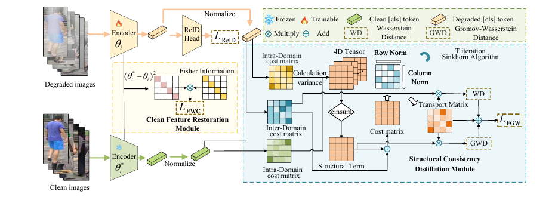

# Robust Mixed-Degradation Person Re-Identification via Structural Consistency Distillation

This is the official repository for the TransReID-SSL-based implementation of **Robust Mixed-Degradation Person Re-Identification via Structural Consistency Distillation**.

Paper: [Pattern Recognition](https://www.sciencedirect.com/science/article/pii/S0031320326009039)

## Method

We propose **Mixed-Degradation Consistency Distillation (MDCD)** for robust person re-identification under mixed degradations such as fog, rain, snow, and brightness variation. MDCD contains two modules: **Structural Consistency Distillation (SCD)** for feature-level structural alignment, and **Clean Feature Restoration (CFR)** for preserving clean-domain discriminative knowledge with Fisher/EWC regularization.



## Prepare Datasets

The mixed-degradation datasets used in this work are not included in this repository. If you need access to the datasets, please contact us at siyuanzhao@whut.edu.cn.

After preparing the datasets, set the dataset path in the corresponding script or config file.

## Training

Run the following scripts in `transreid_pytorch/`.

Before MDCD training, compute the Fisher information for CFR:

```bash
bash run.sh fisher
```

To train the TransReID-SSL baseline, run:

```bash
sbatch run_train_baseline.slurm
```

To train MDCD with the TransReID-SSL branch, run:

```bash
sbatch run_train.slurm
```

Please edit the path variables at the beginning of each script before running.

## Inference

To evaluate a trained model, run:

```bash
sbatch run_test.slurm
```

For local execution without Slurm, use:

```bash
bash run.sh eval
```

## Citation

If this repository is useful for your research, please cite the paper:

```bibtex
@article{zhao2026robust,
title = {Robust mixed-degradation person Re-identification via structural consistency distillation},
journal = {Pattern Recognition},
volume = {179},
pages = {113938},
year = {2026}
}
```

## Acknowledgements

This implementation is based on TransReID-SSL. We also thank the authors of TransReID, DINO, and cluster-contrast-reid for their open-source code.
